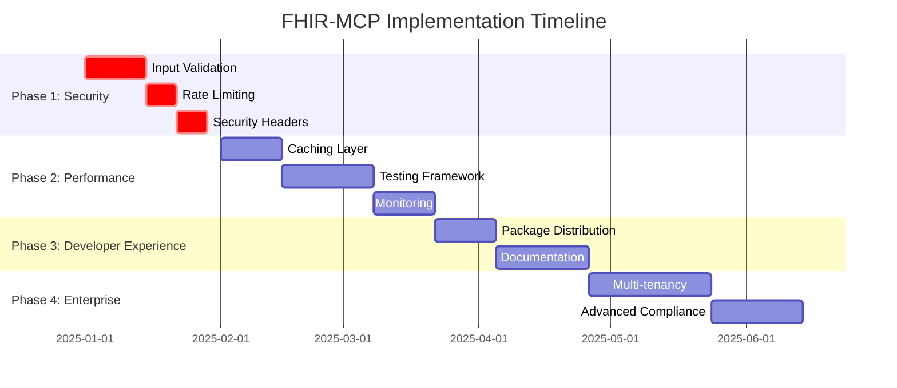

# FHIR-MCP Implementation Roadmap
Error:   265:77  error    '_next' is defined but never used         @typescript-eslint/no-unused-vars

/home/runner/work/fhir-mcp/fhir-mcp/packages/examples/http-bridge/src/security/rate-limiting.ts
## Executive Summary

This roadmap consolidates all findings from the comprehensive QA assessment and provides a structured implementation plan for enhancing the FHIR-MCP project. The project shows strong technical foundation but requires critical security and performance improvements to achieve production readiness and market leadership.

## Current State Assessment

### Competitive Position
- **Market Leaders**: WSO2 FHIR MCP Server, Flexpa FHIR MCP, AgentCare MCP
- **Unique Strengths**: Advanced PHI protection, comprehensive documentation, HL7 terminology support
- **Key Gaps**: Package distribution, community adoption, security hardening

### Technical Quality Score: 7.5/10
| Category | Score | Status |
|----------|-------|--------|
| Security & PHI Protection | 9/10 | Leading |
| Documentation Quality | 9/10 | Leading |
| Test Coverage | 8/10 | Good |
| Performance & Scalability | 5/10 | Needs Work |
| Community & Distribution | 4/10 | Critical |
| Production Readiness | 6/10 | Needs Work |

## Critical Implementation Plan

### Phase 1: Security Hardening (Weeks 1-4)  CRITICAL

#### 1.1 Input Validation & Sanitization
**Priority**: Critical | **Effort**: 2 weeks | **Risk**: High

**Implementation Tasks**:
- [ ] Implement Joi/Zod validation schemas for all FHIR resources
- [ ] Add input sanitization middleware for all API endpoints
- [ ] Create CSRF protection for HTTP bridge endpoints
- [ ] Implement parameter pollution protection
- [ ] Add SQL injection prevention measures
- [ ] Create validation rules for FHIR identifiers and URLs

**Success Criteria**:
- Zero input validation vulnerabilities
- 100% endpoint coverage
- Automated validation testing

#### 1.2 Rate Limiting & Abuse Prevention
**Priority**: Critical | **Effort**: 1 week | **Risk**: High

**Implementation Tasks**:
- [ ] Implement express-rate-limit middleware
- [ ] Add per-user and per-IP rate limiting
- [ ] Create API key-based throttling
- [ ] Implement suspicious activity detection
- [ ] Add IP-based blocking mechanism
- [ ] Create rate limit bypass for emergency scenarios

**Success Criteria**:
- Protection against DDoS attacks
- Configurable rate limits per user type
- Audit logging for all rate limit violations

#### 1.3 Security Headers & OWASP Compliance
**Priority**: Critical | **Effort**: 1 week | **Risk**: Medium

**Implementation Tasks**:
- [ ] Add comprehensive HTTP security headers
- [ ] Implement CORS configuration for healthcare
- [ ] Add Content Security Policy (CSP)
- [ ] Implement X-Frame-Options protection
- [ ] Add request size limiting
- [ ] Create security monitoring alerts

**Success Criteria**:
- OWASP Top 10 compliance
- Security score >95% on security scanners
- Zero critical security vulnerabilities

### Phase 2: Performance & Reliability (Weeks 5-10)  HIGH

#### 2.1 Caching & Performance Optimization
**Priority**: High | **Effort**: 2 weeks | **Risk**: Medium

**Implementation Tasks**:
- [ ] Implement Redis caching layer
- [ ] Add response caching for static FHIR metadata
- [ ] Create database query optimization
- [ ] Implement connection pooling strategy
- [ ] Add resource pagination optimization
- [ ] Create memory management improvements

**Success Criteria**:
- Response time <200ms for basic queries
- Cache hit rate >80%
- Memory usage optimization
- Support for 100+ concurrent users

#### 2.2 Comprehensive Testing Framework
**Priority**: High | **Effort**: 3 weeks | **Risk**: Medium

**Implementation Tasks**:
- [ ] Create integration tests with multiple FHIR servers
- [ ] Implement performance benchmarking suite
- [ ] Add security penetration testing
- [ ] Create end-to-end testing scenarios
- [ ] Implement chaos engineering tests
- [ ] Add compliance testing automation

**Success Criteria**:
- Test coverage >90%
- Automated CI/CD pipeline
- Performance regression detection
- Security vulnerability scanning

#### 2.3 Monitoring & Observability
**Priority**: High | **Effort**: 2 weeks | **Risk**: Low

**Implementation Tasks**:
- [ ] Add Prometheus metrics collection
- [ ] Implement distributed tracing
- [ ] Create custom health check endpoints
- [ ] Add alerting system integration
- [ ] Create performance dashboards
- [ ] Implement audit trail analytics

**Success Criteria**:
- Real-time performance monitoring
- Automated alerting system
- Comprehensive audit trail analysis
- Business intelligence reporting

### Phase 3: Developer Experience (Weeks 11-16)  MEDIUM

#### 3.1 Package Distribution & CLI Tools
**Priority**: Medium | **Effort**: 2 weeks | **Risk**: Low

**Implementation Tasks**:
- [ ] Publish to npm registry
- [ ] Create Docker Hub distribution
- [ ] Develop CLI installation tool
- [ ] Add configuration wizard
- [ ] Create starter templates
- [ ] Implement version management

**Success Criteria**:
- Available on npm with 1000+ downloads/month
- Docker image with <100MB size
- Zero-config setup experience
- Comprehensive starter templates

#### 3.2 Documentation & Community Building
**Priority**: Medium | **Effort**: 3 weeks | **Risk**: Low

**Implementation Tasks**:
- [ ] Create interactive API documentation
- [ ] Add video tutorials and walkthroughs
- [ ] Build community forums/Discord
- [ ] Create contributing guidelines
- [ ] Add code examples in multiple languages
- [ ] Implement community engagement metrics

**Success Criteria**:
- Documentation satisfaction >90%
- Active community of 50+ contributors
- 500+ GitHub stars within 6 months
- Regular community events

### Phase 4: Enterprise & Scale (Weeks 17-24)  ADVANCED

#### 4.1 Multi-tenancy & Enterprise Features
**Priority**: Advanced | **Effort**: 4 weeks | **Risk**: High

**Implementation Tasks**:
- [ ] Design tenant isolation architecture
- [ ] Implement per-tenant configuration
- [ ] Create resource quotas system
- [ ] Add tenant administration dashboard
- [ ] Implement data residency controls
- [ ] Create tenant analytics

**Success Criteria**:
- Complete data isolation
- Scalable resource management
- Enterprise-grade admin interface
- Compliance per jurisdiction

#### 4.2 Advanced Compliance & Governance
**Priority**: Advanced | **Effort**: 3 weeks | **Risk**: Medium

**Implementation Tasks**:
- [ ] Implement GDPR compliance automation
- [ ] Create HIPAA audit automation
- [ ] Add compliance reporting dashboard
- [ ] Implement data lineage tracking
- [ ] Create privacy impact assessment tools
- [ ] Add regulatory change management

**Success Criteria**:
- Automated compliance reporting
- Policy violation detection
- Regulatory requirement mapping
- Audit-ready state

## Risk Assessment & Mitigation

### Critical Risks (High Impact, High Probability)

#### Security Vulnerabilities
**Risk**: Unpatched security vulnerabilities in production
**Impact**: High | **Probability**: High | **Mitigation Timeline**: Immediate

**Mitigation Strategy**:
- Implement all Phase 1 security measures within 4 weeks
- Conduct third-party security audit
- Establish continuous security monitoring
- Create incident response procedures

#### Performance Degradation
**Risk**: Poor performance under load affecting user adoption
**Impact**: Medium | **Probability**: High | **Mitigation Timeline**: 6 weeks

**Mitigation Strategy**:
- Complete Phase 2 performance optimizations
- Implement comprehensive monitoring
- Conduct load testing with realistic scenarios
- Create performance regression testing

#### Community Adoption Failure
**Risk**: Low adoption due to distribution and documentation gaps
**Impact**: High | **Probability**: Medium | **Mitigation Timeline**: 12 weeks

**Mitigation Strategy**:
- Execute Phase 3 community building initiatives
- Partner with healthcare technology organizations
- Present at healthcare IT conferences
- Create compelling use cases and success stories

### Medium Risks (Medium Impact, Variable Probability)

#### Compliance Issues
**Risk**: Regulatory compliance gaps in healthcare environments
**Impact**: High | **Probability**: Low | **Mitigation Timeline**: Ongoing

**Mitigation Strategy**:
- Engage healthcare compliance experts
- Regular compliance audits
- Stay updated with regulatory changes
- Implement automated compliance checking

#### Technical Debt Accumulation
**Risk**: Rapid development leading to technical debt
**Impact**: Medium | **Probability**: Medium | **Mitigation Timeline**: Ongoing

**Mitigation Strategy**:
- Maintain high code quality standards
- Regular refactoring sessions
- Comprehensive code reviews
- Automated quality gates

## Resource Requirements

### Team Composition
- **Security Engineer**: 1 FTE (Phases 1-4)
- **Backend Developer**: 2 FTE (Phases 1-3)
- **DevOps Engineer**: 1 FTE (Phases 2-4)
- **Technical Writer**: 0.5 FTE (Phases 3-4)
- **Community Manager**: 0.5 FTE (Phases 3-4)
- **Healthcare Compliance Specialist**: 0.5 FTE (Phases 1,4)

### Infrastructure Requirements
- **Development Environment**: Cloud-based CI/CD pipeline
- **Testing Infrastructure**: Load testing environment
- **Security Tools**: SAST/DAST scanners, penetration testing tools
- **Monitoring Stack**: Prometheus, Grafana, ELK stack
- **Compliance Tools**: Audit logging, compliance reporting systems

### Budget Estimation (24 weeks)
- **Personnel**: $400,000 - $500,000
- **Infrastructure**: $10,000 - $15,000
- **Tools & Licenses**: $20,000 - $30,000
- **Third-party Services**: $15,000 - $25,000
- **Total**: $445,000 - $570,000

## Success Metrics & KPIs

### Technical Metrics
- **Security**: 0 critical vulnerabilities, <5 medium vulnerabilities
- **Performance**: <200ms response time, >99.9% uptime
- **Quality**: >90% test coverage, >85% code quality score
- **Reliability**: <0.1% error rate, automated recovery

### Business Metrics
- **Adoption**: 1000+ npm downloads/month, 500+ GitHub stars
- **Community**: 50+ active contributors, 10+ enterprise users
- **Market Position**: Top 3 in healthcare MCP server category
- **Revenue**: $100K+ in enterprise licensing within 12 months

### Compliance Metrics
- **HIPAA**: 100% critical requirement compliance
- **GDPR**: Automated privacy compliance reporting
- **Security**: Regular security audits passing >95%
- **Documentation**: >90% user satisfaction scores

## Implementation Timeline

## Next Steps & Action Items

### Immediate Actions (Week 1)
1. [ ] Form implementation team and assign roles
2. [ ] Set up development and testing environments
3. [ ] Conduct security audit of current codebase
4. [ ] Create detailed project timeline with milestones
5. [ ] Establish communication channels and reporting structure

### Week 2-4 Focus
1. [ ] Begin Phase 1 security implementations
2. [ ] Set up continuous integration pipeline
3. [ ] Establish code quality standards and reviews
4. [ ] Create stakeholder communication plan
5. [ ] Begin third-party security assessment

### Monthly Reviews
- Progress against timeline and milestones
- Budget and resource utilization
- Risk assessment and mitigation updates
- Market positioning and competitive analysis
- Community feedback and adoption metrics

---

**Document Version**: 1.0  
**Last Updated**: January 2025  
**Next Review**: February 2025  
**Owner**: FHIR-MCP Development Team